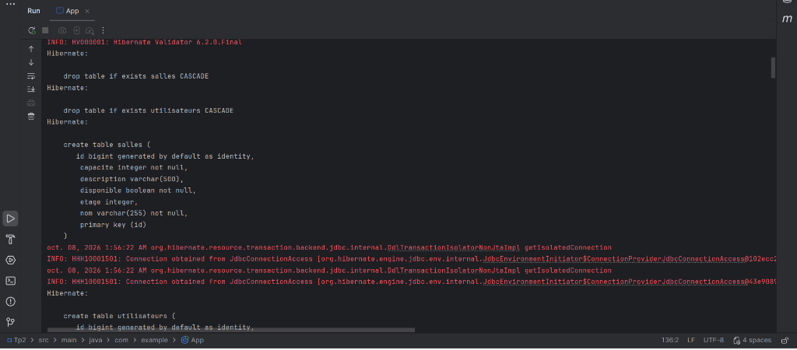
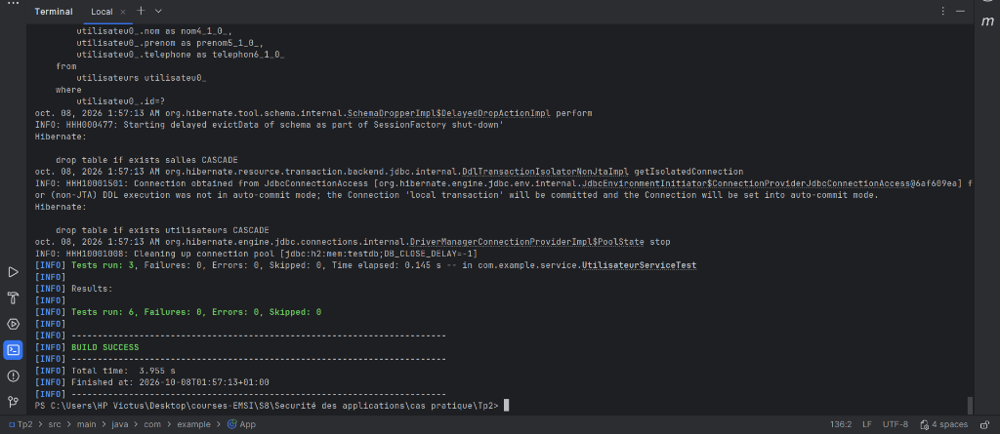

# TP 2 : Gestion des Salles et Utilisateurs

Application Java développée avec JPA (Hibernate) et une base de données H2 en mémoire, permettant la gestion complète de salles et d'utilisateurs avec validation de données et opérations CRUD génériques.

---

## Architecture du Projet

Le projet suit une organisation modulaire séparant les entités métier, les services de persistance et le point d'entrée de l'application :

```text
Tp2/
├── pom.xml
└── src/
    ├── main/
    │   ├── java/
    │   │   └── com/
    │   │       └── example/
    │   │           ├── App.java
    │   │           ├── model/
    │   │           │   ├── Salle.java
    │   │           │   └── Utilisateur.java
    │   │           └── service/
    │   │               ├── AbstractCrudService.java
    │   │               ├── CrudService.java
    │   │               ├── SalleService.java
    │   │               └── UtilisateurService.java
    │   └── resources/
    │       └── META-INF/
    │           └── persistence.xml
    └── test/
        └── java/
            └── com/
                └── example/
                    └── service/
                        ├── SalleServiceTest.java
                        └── UtilisateurServiceTest.java
```

### Description des Composants

- **Entités (`com.example.model`)** :
  - `Salle` : Modélise une salle avec libellé, capacité d'accueil, descriptif, étage et état de disponibilité. Intègre des contraintes de validation (`@NotBlank`, `@Min`, `@Max`, `@Size`, etc.).
  - `Utilisateur` : Modélise un utilisateur avec nom, prénom, email unique, date de naissance et téléphone, contrôlés par validation Bean Validation (`@Email`, `@Past`, `@Pattern`, etc.).

- **Services de Persistance (`com.example.service`)** :
  - `CrudService<T, ID>` : Interface générique définissant les opérations CRUD standard (`save`, `findById`, `findAll`, `update`, `delete`, `deleteById`).
  - `AbstractCrudService<T, ID>` : Classe de base encapsulant la gestion des transactions JPA (`executeInTransaction`, `runInTransaction`, `executeReadOnly`) et éliminant le code répétitif d'ouverture/fermeture de sessions.
  - `SalleService` : Service spécialisé offrant des requêtes JPQL avancées (filtrage par disponibilité, filtrage par seuil de capacité minimum).
  - `UtilisateurService` : Service spécialisé intégrant la recherche par adresse électronique unique.

- **Exécution (`com.example`)** :
  - `App` : Orchestrateur principal exécutant les scénarios de démonstration pour les deux modules.
  - `Main` : Point d'entrée déléguant l'exécution vers la classe `App`.

---

## Technologies et Dépendances

- **Langage** : Java (JDK 8+)
- **Build & Gestion des dépendances** : Apache Maven
- **ORM / Persistance** : Hibernate Core 5.6.5.Final (JPA 2.2)
- **Validation** : Hibernate Validator 6.2.0.Final
- **Base de Données** : H2 Database (moteur in-memory)
- **Tests** : JUnit 4.13.2
- **Logging** : SLF4J (API & Simple)

---

## Captures d'Exécution

### 1. Démarrage de l'Application et Création du Schéma
Lancement de l'application via l'environnement de développement montrant l'initialisation du moteur Hibernate Validator, la génération DDL automatique des tables `salles` et `utilisateurs`, ainsi que l'application des contraintes d'intégrité :



### 2. Exécution des Tests Unitaires (`mvn test`)
Exécution de l'ensemble des tests automatisés (`SalleServiceTest` et `UtilisateurServiceTest`) validant le bon fonctionnement des opérations de persistance et des requêtes JPQL personnalisées :



---

## Instructions d'Exécution

### Compiler le projet
```bash
mvn clean compile
```

### Lancer les tests unitaires
```bash
mvn test
```

### Exécuter l'application principale
```bash
mvn exec:java -Dexec.mainClass="com.example.App"
```
ou directement depuis un IDE (IntelliJ IDEA, Eclipse, VS Code) en exécutant la classe `App` ou `Main`.
